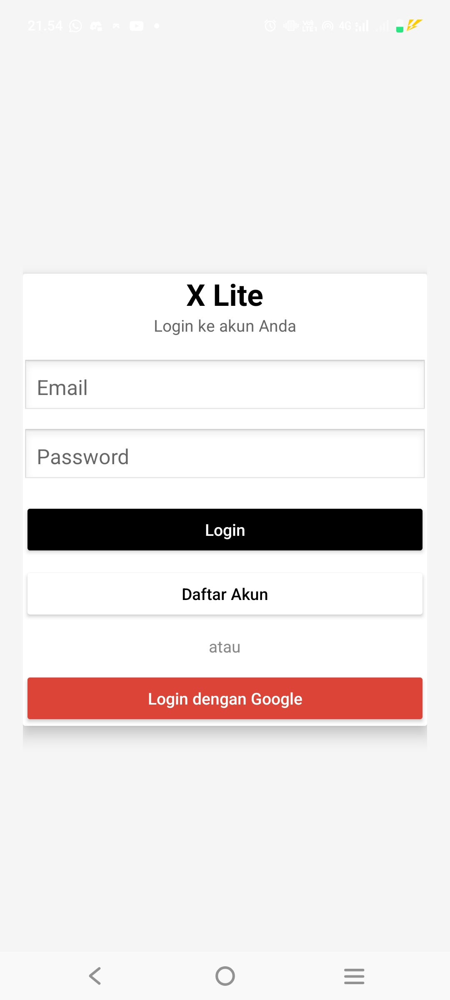
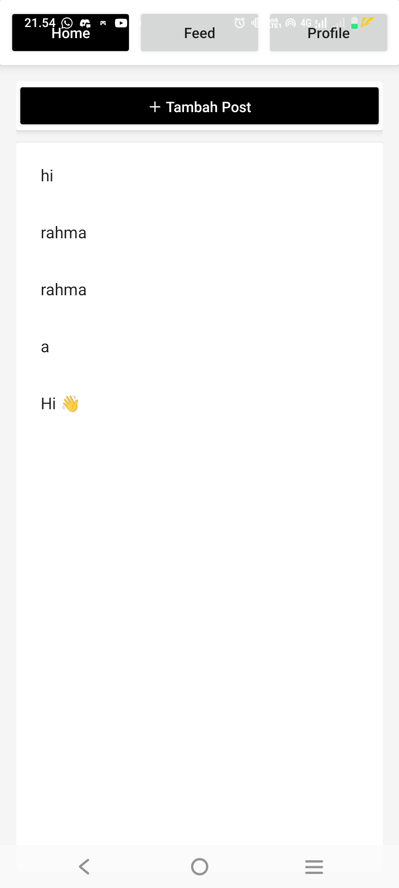
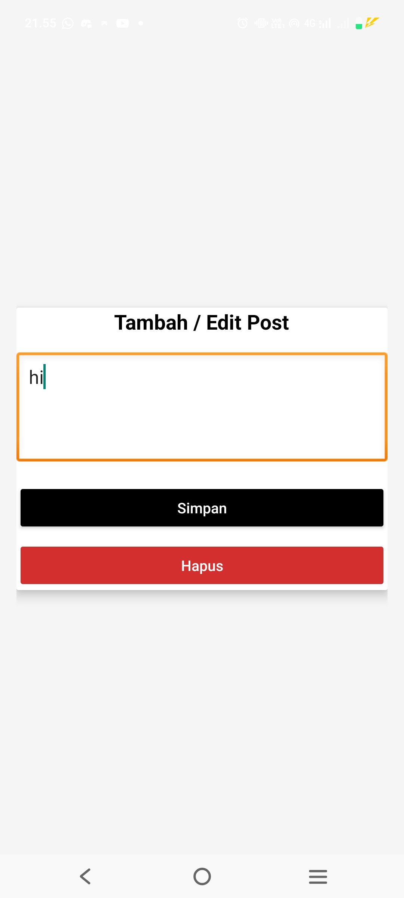
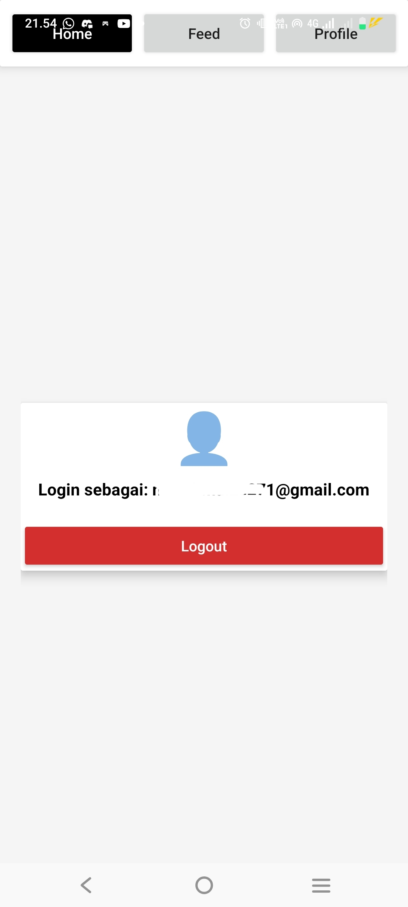
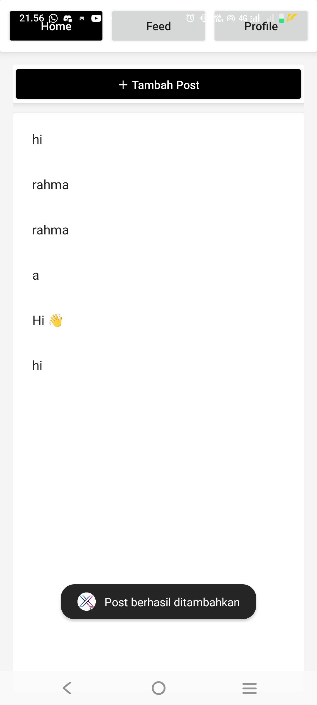

# XLite App

## Identitas
- Nama  : Nur Rahma  
- NIM   : 2304411422  
- Kelas : 5J RPL 2  

---

## Tema Aplikasi
Aplikasi mobile versi ringan (*lite*) yang dirancang untuk memberikan performa cepat, antarmuka sederhana, serta penggunaan sumber daya yang efisien pada perangkat dengan spesifikasi rendah.

### Aplikasi Rujukan (Play Store)
- Nama Aplikasi : X (Twitter) 
- Link          : https://play.google.com/store/apps/details?id=com.twitter.android

---

## Fitur yang Dibuat
- [x] Login pengguna  
- [x] Menampilkan daftar data  
- [x] Menambah data  
- [x] Mengedit data  
- [x] Melihat detail data  
- [x] Notifikasi aplikasi  

---

## Screenshot Aplikasi

### Halaman Login

### Halaman List Data

### Halaman Tambah Data

### Halaman Edit Data

### Halaman Detail Data

### Notifikasi Aplikasi

---

## Cara Menjalankan Aplikasi
- Membuka project aplikasi menggunakan Android Studio  
- Memastikan Android SDK dan emulator telah terpasang dengan baik  
- Melakukan sinkronisasi Gradle hingga proses selesai  
- Menjalankan aplikasi menggunakan emulator Android atau perangkat fisik  
- Jika aplikasi menggunakan Firebase, pastikan konfigurasi Firebase sudah terhubung dengan project  
- Memastikan koneksi internet aktif agar fitur yang membutuhkan data online dapat berjalan dengan baik
